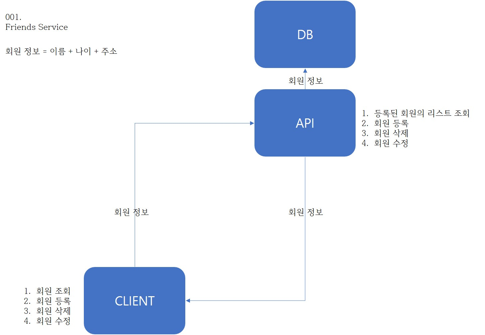

# 001.Friends

### About Project

 본 프로젝트는 

+ `Spring Boot` , `REST API` , `REST Templet`, `JPA`, `Docker`, `AWS` 등의 기술을 학습 및 체득 하기 위한 프로젝트이다.  

+ `API Server`, `Client`, 2개의 아키텍처로 구성되어 있으며 데이터 흐름도 및 단위 기능 실행 화면은 아래와 같다.

### DFD 

> API Server  https://github.com/jojun94/toy-friends-api
>
> Client https://github.com/jojun94/toy-friends-client

